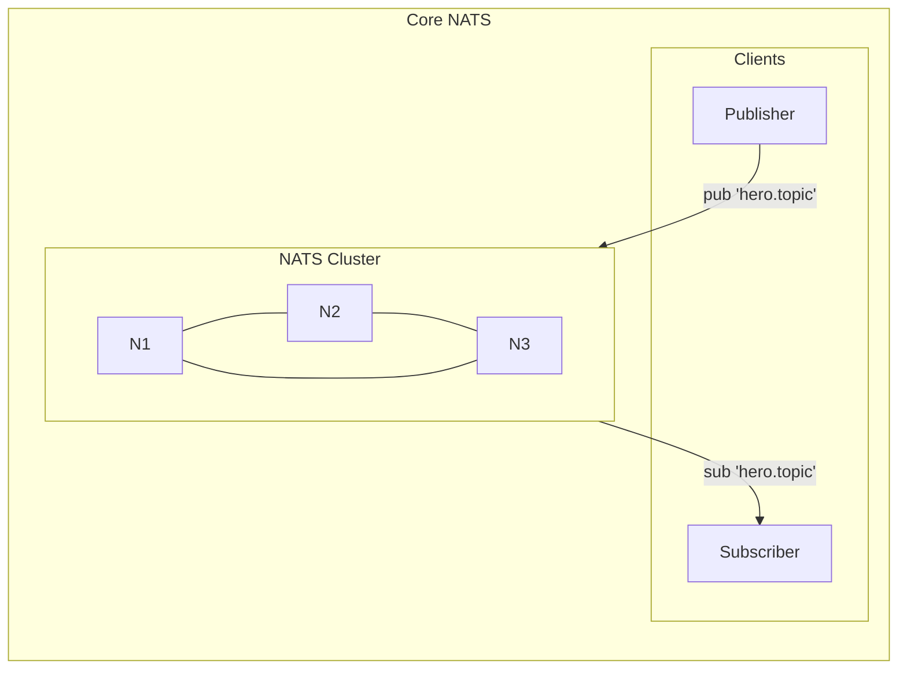

# NATS Messaging

## Simplicity Meets Performance

---

## In a World of Complex Brokers

- **Simplify**: Zero dependencies, single binary, 20MB footprint
- **Scale**: Millions of messages per second on commodity hardware
- **Deploy**: From edge devices to cloud clusters in seconds

---

## What is NATS?

Lightweight messaging system writen in Go, built for cloud-native and edge computing.

**Key Features:**
- Zero-dependency binary (no JVM, no ZooKeeper)
- Multiple messaging patterns: pub/sub, request/reply, queues
- JetStream for persistence and exactly-once delivery
- Built-in clustering with automatic failover

---

## Architecture

**Two-Layer Design:**

- **Core NATS**: In-memory pub/sub (fire-and-forget)
- **JetStream**: Optional persistence layer for durability



---

## NATS vs. Alternatives

### Resource Requirements (from official docs)

| System | Production RAM | Production CPU | Dependencies |
|--------|----------------|----------------|--------------|
| **NATS** | Not specified (runs on Raspberry Pi) | Not specified | None |
| **RabbitMQ** | 4 GB minimum per node | 4 cores minimum | Erlang VM |
| **Kafka** | 64-128 GB | 8 cores | JVM + KRaft |
| **Pulsar** | 8 GB (broker) + 8 GB (bookie) + 2 GB (ZK) | 8 + 4 + 1 cores | JVM + BookKeeper + ZooKeeper |

### Infrastructure Complexity

| System | Minimum Production Cluster | External Dependencies |
|--------|---------------------------|----------------------|
| **NATS** | 3 nodes (single binary each) | None |
| **RabbitMQ** | 3 nodes + Erlang runtime | Erlang/OTP |
| **Kafka** | 3 brokers with KRaft controllers | JVM |
| **Pulsar** | 3 ZooKeeper + 3 BookKeeper + 3 Brokers = 9 processes minimum | JVM, ZooKeeper, BookKeeper |

### Persistence Model

| System | Storage Architecture | Delivery Guarantees |
|--------|---------------------|---------------------|
| **NATS** | Optional (JetStream adds file/memory persistence) | At-most-once (core), at-least-once (JetStream) |
| **RabbitMQ** | Quorum queues (Raft-based), classic queues | At-least-once |
| **Kafka** | Append-only distributed log | At-least-once, exactly-once with transactions |
| **Pulsar** | BookKeeper (distributed ledger) | At-least-once, exactly-once with transactions |

### Messaging Patterns

| Pattern | NATS | RabbitMQ | Kafka | Pulsar |
|---------|------|----------|-------|--------|
| Pub/Sub | Native | Via exchanges | Via topics | Native |
| Queue Groups | Native | Native | Via consumer groups | Via subscriptions |
| Request/Reply | Native | Manual correlation | Manual correlation | Manual correlation |
| Wildcards | Native (*, >) | Routing keys | No | No |
| Message Replay | JetStream | Limited | Native (log-based) | Native |

### Operational Considerations

**NATS**
- Single static binary, no runtime dependencies
- Deploys on edge devices to cloud clusters
- JetStream adds persistence without external systems
- Avoid NFS/NAS for JetStream storage (use local SSD)

**RabbitMQ**
- Memory watermark default: 60% of available RAM
- Classic mirrored queues removed in 4.0 (use quorum queues)
- Requires 50K+ file descriptors in production
- Erlang GC can cause 2x memory spikes during collection

**Kafka**
- ZooKeeper removed in Kafka 4.0 (March 2025), KRaft is mandatory
- Partition rebalancing required when scaling
- Log compaction for event sourcing use cases
- Strong ecosystem (Connect, Streams, ksqlDB)

**Pulsar**
- Separate compute (brokers) and storage (BookKeeper) scaling
- Built-in multi-tenancy and geo-replication
- Tiered storage for cost optimization
- Highest operational complexity (3 distributed systems)

### When to Use Each

| Use Case | Best Fit | Rationale |
|----------|----------|-----------|
| Edge/IoT deployments | NATS | Runs on constrained devices, no dependencies |
| Microservices communication | NATS | Request/reply native, minimal overhead |
| Complex message routing | RabbitMQ | Flexible exchange types and bindings |
| High-volume event streaming | Kafka | Log-based architecture, mature ecosystem |
| Multi-tenant SaaS | Pulsar | Built-in tenant isolation |
| Global distribution | Pulsar | Native geo-replication |

**NATS Sweet Spot:** Microservices, IoT, edge computing requiring minimal ops with low latency.

---

## CLI POC

---

## Key Takeaways

✓ **Minimal Footprint:** 20MB binary, no dependencies, runs anywhere
✓ **High Throughput:** Millions of msg/sec with microsecond latency
✓ **Flexible Patterns:** Pub/sub, queues, streaming in one system
✓ **Zero Config:** Queue groups and clustering work out of the box
✓ **Operational Simplicity:** Single binary, no ZooKeeper, minimal resources

---

## Try It Yourself

**Run the POCs:**

```bash
docker compose up -d

mvn exec:java -Dexec.mainClass="com.nats.Publisher"
mvn exec:java -Dexec.mainClass="com.nats.QueueWorker"
mvn exec:java -Dexec.mainClass="com.nats.JetStreamPublisher"
```

**Resources:**
- NATS Docs: https://docs.nats.io
- POC Source Code: github.com/vikthorvergara/nats-playground

---

## P.S. About Those Performance Numbers

The "millions of messages per second" claim comes from [NATS official benchmarks](https://docs.nats.io/using-nats/nats-tools/nats_cli/natsbench) run on a MacBook Pro M4 (10 cores, 16 GB RAM) with NATS 2.12.1:

| Scenario | Throughput |
|----------|------------|
| Single publisher, no subscribers | ~14.8M msg/sec |
| 1 publisher + 1 subscriber | ~4.9M msg/sec |
| Fan-out (1 pub, 4 subs) | ~4M msg/sec aggregate |
| JetStream sync publish | ~35K msg/sec |
| JetStream batch publish | ~627K msg/sec |
| JetStream async publish (file) | ~403K msg/sec |

These are local benchmarks with 16-byte messages. Real-world throughput depends on message size, network, persistence settings, and hardware. Run your own benchmarks with `nats bench` before committing to production capacity planning.
